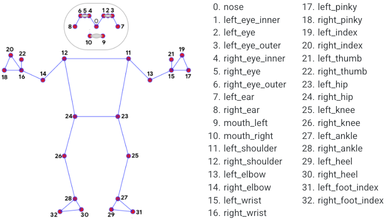

# DeadLift Bot
### The goal of our machine learning model is to track Dead position and cout the number of  reps , probability of accurate position.

Pose estimation is a computer vision task that infers the pose of a person or object in an mage or video. We can also think of pose estimation as the problem of determining the position and orientation of a camera relative to a given person or object. This is typically done by identifying, locating, and tracking a number of keypoints on a given object or person. For objects, this could be corners or other significant features. And for humans, these keypoints represent major joints like an elbow or knee.

##                                            OUTPUT

### Take Notes 
1) Creating  Data-Set.

2) Use open-cv and Python to access the WebCam.

3) Extracting the Body’s Coordinate.(Using Mediapipe Model)

4) Collecting keypoints for specific  Poses (Example : ‘up’ , ‘down’ (in this case) ) Save  them in csv file.

5) Build a Custom Trained Scikit Learn Classifier Model.

### Workflow 

1) So, First we need to collect data for Our ML model.

2) From this data Our model will able to actually sees(both input and output) and learns from

3) By using mp.solutions.pose  we will be able to track Body and landmarks

4) Each Landmarks have Values of x , y , z and visibility in it

5) We just can’t use this coords, its need to be converted in np.array

6) Once we had our data we need to feed it to our machine learning

7) After Training the model . It’s time to use it

8) Then load and integrate the model in detection  code with the help of pickle 

### Algorithm 

1) Classifier use in this model Random forest

2) Random forest is a Supervised Machine Learning Algorithm that is used widely in Classification and Regression problems. It builds decision trees on different samples and takes their majority vote for classification and average in case of regression.

3) One of the most important features of the Random Forest Algorithm is that it can handle the data set containing continuous variables as in the case of regression and categorical variables as in the case of classification. It performs better results for classification problems.

### Reference 
1) Mediepipe : https://google.github.io/mediapipe/solutions/pose.html
2) Sklearn : https://scikit-learn.org/stable/modules/generated/sklearn.ensemble.RandomForestClassifier.html
3) Nicholas Renotte(video reference) : https://www.youtube.com/watch?v=H7cGq0xIHbc&t=278s

